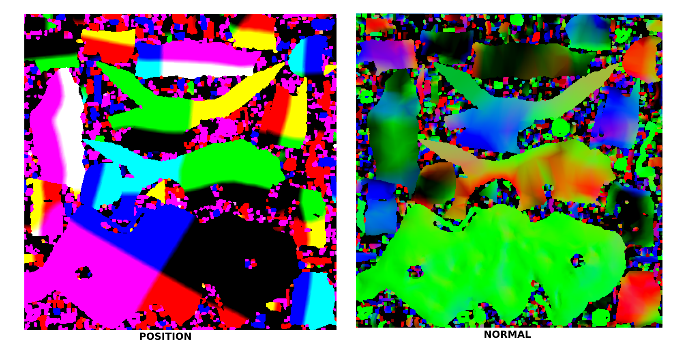
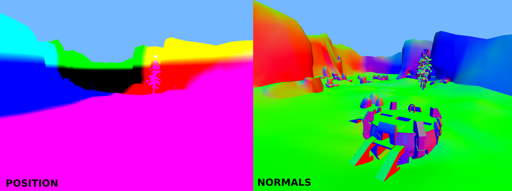

# 🍞 Three Lightmap Baker

<h3 align="center">Basic example of lightmapping in ThreeJS</h3>
<h4 align="center">✨ Big Thanks for <a href="https://github.com/gkjohnson/three-mesh-bvh">Three Mesh BVH</a>, <a href="https://github.com/gkjohnson/three-gpu-pathtracer">Three GPU Pathtracer</a> & <a href="https://github.com/repalash/xatlas-three/">XAtlas-Three</a> for been excellent libraries ✨</h4>
<h1 align="center">
<a href="https://lucas-jones.github.io/three-lightmap-baker/">Live Demo</a></h1>

## Todo
 - Progressive renderer
 - Convert to an API
 - NPM Package
 - Add denoiser options
 - High casts can cause the WebGL context to timeout
 - Import & Export models & lightmaps
 - Bounce lighting
 - Albedo & Emissive textures
 - Only denoise indirect light & AO
 - Denoise offline (using Optix)
 - Try import/use more GPU Pathtracer logic
 - Multiple lights, light types, light colour
 - Downscaling
 - Seperate AO map
 - Generate & export light probes

## Examples

## How it works
1. Pass all the geomerty into [XAtlas-Three](https://github.com/repalash/xatlas-three/) (UV unwrapping library). This will generate a "UV2" attribute on the geometry.
2. Render the geomerties vericies in the UV2 space. Create two textures (resolution being the lightmap resolution), using the gl_FragColor to encode **world position** and the **normal**. This is packing Vec3 data into a texture using the RGB channel.

**Visual reference:** Using these textures as the lightmap (using UV2). 

3. These two texture are effectivly a 2D array of World Position & Normals covering the entire geomerty.
4. Itterate through each World Position & Normal. Cast rays at each position to calculate incoming light.

**Visual reference:** Creating arrows for each world positon & the normal

5. The Three Mesh BVH library helps improve the performance of raycasting, it also allows raycasting on the GPU (this is super fast). 
6. Using A LOT of copy & pasted code from Three GPU Pathtracer to generate light

## Further Reading / Watching
 - [I made a better Ray-Tracing engine](https://www.youtube.com/watch?v=A61S_2swwAc)
 - [High level overview of a lightmapping generation process](https://www.reddit.com/r/GraphicsProgramming/comments/brl22k/high_level_overview_of_a_lightmapping_generation/)
 - [Baking artifact-free lightmaps on the GPU](https://ndotl.wordpress.com/2018/08/29/baking-artifact-free-lightmaps/)
 - [Radiosity Baker](http://david-westreicher.github.io/2014/05/31/radiosity/)
 
 ## Credit
  - [Level Blockout Model - DJMaesen](https://sketchfab.com/3d-models/level-blockout-24b39d9beef54166a14e6f2542d01def)
